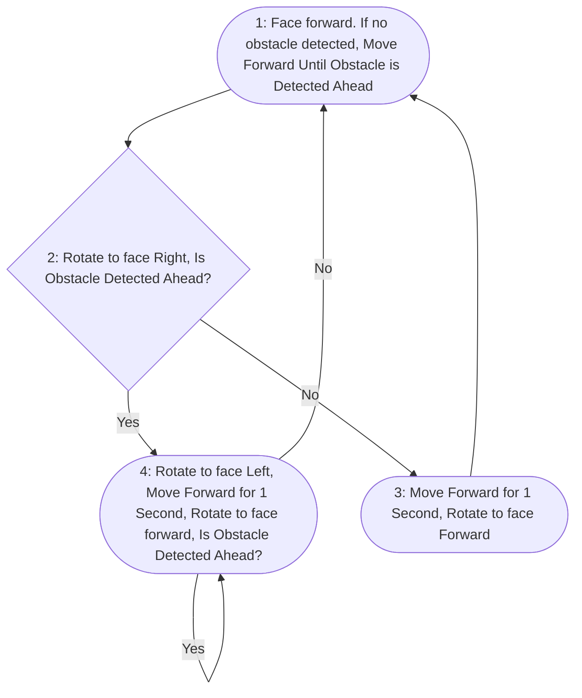

# **GAME RULE**

**Welcome to the Collaborative Two-Wheeled Self-Balancing Car Challenge! (Game Day: Nov 6)**

In this thrilling competition, two two-wheeled self-balancing cars face a daunting challenge. They must work together, carrying a foam board (the cap of your balanced car container) across a treacherous 5-meter-long and 2-meter-wide track. The path ahead is scattered with various obstacles, and while one car is equipped with an ultrasonic sensor to guide the way, the other is blind to the dangers ahead. Through Bluetooth communication, they will share their vision and navigate the course, balancing speed and precision in a race for glory. Will they emerge victorious, or will the obstacles claim their journey?

**Note: This is a group project. You need to work with teammates. This project spec is subject to small changes. Please always use this website to access the newest project spec.**

## **1. Track and Starting Point**

The stage is set. A sleek, polished arena stretches 5 meters long and 2 meters wide. The walls shimmer with the promise of a challenge. At the starting point, the two cars sit still, their engines humming softly. In front of them lies the obstacle-strewn track, their adversary for the day.

In the silence before the race begins, there’s a bond between them—a shared goal. One robot, sleek and equipped with an **ultrasonic sensor**, will serve as the guide. It can detect obstacles, anticipate dangers, and share vital information. Its partner, a robust but sensorless robot, will rely entirely on the sensor-equipped car for direction.

The race begins in a dramatic fashion. Both cars rotate **360 degrees together (During this part, time cost will not be counted, and this worth 20 points)**, signaling their intent and readiness to tackle the challenge. The foam board, their shared burden, sits carefully balanced on top. The decision lies ahead: How will these two cars collaborate? The choice could mean triumph or disaster, but the journey must begin.

## **2. Track Category**

Now, the adventure truly unfolds. Three tracks lie ahead, each more dangerous than the previous one, each offering its own unique puzzle of obstacles:

- **Easy Track (Score: 80 points):** They see the cylinders first. These tall, smooth obstacles stand in their path, but there’s a sense of predictability. All sides are flat, and the track itself has no risk of dead ends. The cylinders offer a gentle challenge, perfect for those beginning their journey. The **ultrasonic sensor car** measures the cylinders ahead and guides its partner along the safest route. The path is long, but the cylinders are no match for their teamwork.
- **Medium Track (Score: 60 points):** As the robots enter the medium track, tension rises. The obstacles are now a mix—cylinders and **cubes** scattered unpredictably. **All cubes present only their surfaces(this means that all the surfaces of the cubes will be parallel or normal to the two sides of the track)**, demanding more precision. The cubes, occupying more space, offer less grip for their board and the slightest misstep could lead to disaster. Each route leads to the finish, but the journey is far from easy.
- **Hard Track (Score: 40 points):**
  For the bravest of competitors, the hard track looms like a mountain of peril. **Cubes** and **cylinders** are scattered. Some obstacles stand silently in shadow, waiting for a miscalculation. Worse still, the track twists and turns, offering **dead ends**, traps that threaten to devour the robots' progress. Only one correct path leads to victory, but the **ultrasonic sensor car** has seen this before. It sends a pulse to its partner—a signal that warns the dead end. Time is not their friend, but neither is haste.

## **3. Failures and Penalties**

But every hero's journey is marked by the threat of failure. For these two brave robots, failure is not a distant possibility.

- **Failure Definition:** The rules are clear: if the car **falls**, the **foam board touches the ground**, or **car is stuck in one certain area**, they fail. The crowd holds its breath every time the board tilts dangerously close to the edge of a cube or cylinder.
- **Chances to Fail:** Each team has **6 chances** to fail. Once they use them all, the game is over.
- **Want to try again?** Yes, you can. If you get a partial credit on a track, you can choose to spend one more chance on it before we move on to the next track.

  - **Case 1:** If they conquer the easy track without a single failure, they hold on to their chances, precious tokens they can use when the path becomes rougher.
  - **Case 2:** But if they falter in the early stages, their pool of chances dwindles, and their quest becomes ever more perilous. Every fail chips away at their hope.

## **4. Collaboration and Bluetooth Communication**

But above all else, this race is a story of teamwork. One robot holds the key to seeing the obstacles ahead, but it cannot act alone. It must rely on its sensorless partner to navigate and carry the board with equal precision. They speak a silent language, a series of **Bluetooth signals** exchanged in the heat of the moment, guiding, warning, celebrating small victories as they move forward.

**Reminder: The Bluetooth module is essential for effective teamwork and navigation in this competition. It must be used to transmit necessary data between the sensor-equipped car and the sensorless car. If the Bluetooth communication is not utilized practically and effectively to share essential information, half of points will be deducted as a penalty.**

## **5. Scoring and Timing**

With every second that passes, the tension mounts. The journey is long, but they must be swift, for time is an unforgiving adversary. **Time will start to be counted when your car passes the starting line.**

- **Timing Penalty:** Time marches on. For the first **120 seconds**, they are safe—no penalties, no rush. But after that, every second costs them **1 point**. The clock ticks, their score dwindles. Can they maintain the delicate balance between speed and caution?
- **Distance Score:** To encourage progress through the track, a distance-based scoring system is in place. The score calculation will include a percentage factor determined by the distance covered. The percentage factor is defined as **(distance travelled / 5 meters)**. 

  - **Example 1:** If they complete **3 meters** of the track, the distance percentage factor will be **3 meters / 5 meters = 0.6**. The starting score and penalty-free time are then multiplied by 0.6.
  - **Example 2:** If they complete the full **5 meters**, the distance percentage factor will be **5 meters / 5 meters = 1.0**. In this case, the starting score and penalty-free time remain unaffected.
- **Collision Deductions:**
  Collisions with obstacles lead to point deductions. For each **collision** with a cube or cylinder, **3 points** are deducted from the final score. Teams must be careful to avoid unnecessary collisions to maximize their score.

As they cross the end of the track, victory within their grasp, signaling the end of their quest and stopping the clock. The score is tallied based on several factors: their **time**, their **collisions**, their **distance travlled**, and their **bonus points** for unused chances. 

### **Final Score Calculation:**

The final score is calculated as:

**One-track score = (Full score × Distance factor) - Overtime deduction - (Collision penalty × Number of collisions)**

**Final score = (360-degree rotation) + Easy track score + Medium track score + Hard track score + Bonus points**

Where:

- **Distance factor** = Distance travelled / 5 meters
- **Time deduction** = 1 point per second after the penalty-free period (120 seconds)
- **Collision penalty** = 3 points per collision
- **Bonus point** = 3 points for each unused chance

For example, if they braved the **Hard Track**, finished the race in **130 seconds** (with the first 120 seconds free from penalty), collided with **2 cubes** and **1 cylinder**, advanced **4 meters**, their final score would be:

**Hard track score = (40 × 4/5) - (1 × (130 - 120)) - (3 × 3) = 13 points.**

## **Important Reminder:**

The easy track has been set up in the empty space before the regular lab room. You can use it anytime.

On the game day, you must **check your code** thoroughly before the game starts. You will have one chance to adjust your car setup before each track. Before each track starts, you need to hand over your car to us and no more modifications are allowed. Your order to start the game will be determined randomly on the game day.

On the game day, the track will be set up from **Easy**, to **Medium**, and finally to **Hard**. Each team will be given a total of **6 chances to FAIL**. An attempt is considered **failed** if the car falls or the foam board touches the ground or the car is stuck in a corner. 

Example 1: if you can pass the easy track on your first attempt, you still have 6 chances. You can use the rest of chances in more difficult tracks.

Example 2: if you fail the easy track 6 times, you have no chances left.

## **Hint**

**As it is simpler to debug a single car, please figure out how to pass the obstables with a single car first. We will provide you the pillars to connect the two cars together in a few days, as detailed below.**

To allow both cars to cross the finish line together with the foam board, you can place one car upside down and stack them with the foam board in between. Drill four holes in the foam board, and have the upper car use an ultrasonic sensor to measure the distance. The measured data can then be sent to the lower car.

  

When writing your code, you can refer to the logic depicted in the following figure. Please use it as a guide to understand the flow and structure required for implementing your solution. Make sure to carefully analyze the sequence of operations, conditions, and interactions illustrated, and align your code accordingly to achieve the desired behavior.

**Note**: As the easy track is provided to you, you may hard-code the strategy. However, doing so may prevent you from successfully passing the medium and hard tracks.

**Topology**

Easy track: The topology is provided and fixed, as in the figure below.

Medium track: The topology consists of three layers, each including two or three obstacles. The distance between layers is flexible. The two cylinders on the second layer are fixed. The horizontal distance between the cube and the two cylinders on the second layer is flexible.

Hard track: An example is provided below. On the game day, a similar track will be provided. The logic provided above has been tested to pass the hard track. 

  

## **Ready?**

The road is long, the obstacles plenty, and only those who communicate, collaborate, and persevere will prevail. Will you guide your team to victory on this winding, obstacle-ridden track? The journey is about to begin…

---
